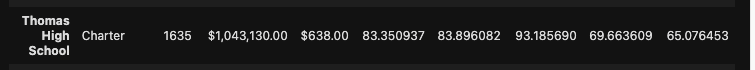
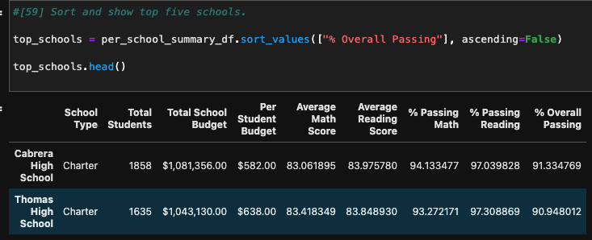

# School District Analysis

## Overview 

The purpose of this analysis was to generate a district-wide summary while using Jupyter Noteboooks and Pandas Library. The raw data was provided by several CSV files. During this project, the data was explored, inspected, manipulated, cleaned, and converted into DataFrames. 

The project's main goal was to assist the PyCitySchool Data Analyst. The mock assignment required a comprehensive analysis of PyCitySchool system in regards to their student's information. The information to be analyzed entailed student standardized test scores and their school funding.

PyCitySchool data provided information on their district and charter high schools. There was a total of 15 schools and 39,170 students. The results found from this analysis will allow its leaders to make strategic decisions on school budgets and funding.

## Resources

For this project, Anaconda, an open source distribution software, was used. Anaconda supports the use of Jupyter Notebook along with Python. Jupyter Notebook enabled the process of creating and merging documents containing live code. Jupyter is widely used by data analyst around the world. 

These tools were vital in our quest to read raw data, change layout and structure, organize the data by type, and create tables. It is similar to Excel/VBA's functionality. However, Jupyter and Pandas Library exceeds in performance and optimization when compared to Excel. Hence, Jupyter, along with Python, was the suitable tool to use for the data wrangling required for this project.

## Results

For this project we manipulated and calculated data to create DataFrame tables to be used for easier visualization. The following are a few of the tables created to inspect the data:

- Student Total Counts
- School Total Budgets
- Average Math and Reading Scores (including by grades)
- Percentage of Students Passing Math/Reading 
- Overall Passing Scores
- School Summary
- District Summary
- Top and Low Performing Schools

In order to test the evidence of academic dishonesty, the data needed to be manipulated for this purpose. The school board was interested in the results of Thomas High School's ninth graders after changing its Math and Reading scores. To do this effectively, the scores for these subjects were replaced with NaNs (Not a Number), while maintaining the rest of the data intact.

After the data manipulation, the school district analysis was repeated to show the overall changes that affected the analysis. As a result of the data wrangling, the following was observed:

### Before the change:

- Passing Math Percentage = 93.3%
- Passing Reading Percentage = 97.3%
- Overall Passing Percentage = 90.9%

### After the changes:

- Passing Math percentage = 93.2%
- Passing Reading Percentage = 69.7%
- Overall Passing percentage = 65.1%

## Fig.1 

## Fig.2 

## Observation

After the changes, the Passing Math Percentage did not change significantly. However, there was an extreme decrease on the Passing Reading and Math Percentages. The ranking for Thomas High School was also lowered as a result from its original second spot.

## Summary

Due to the inconsistencies, and in order to protect the integrity of testing standards, more analysis should be done. A similar comprehensive analysis (such as the one we created) from previous years will enable to compare when the problem, if any, began. Conducting student surveys and interviews on standardized testing may also show key information about the behavior of academic dishonesty in this case. Comprehensive analysis should also be completed on a yearly basis.
