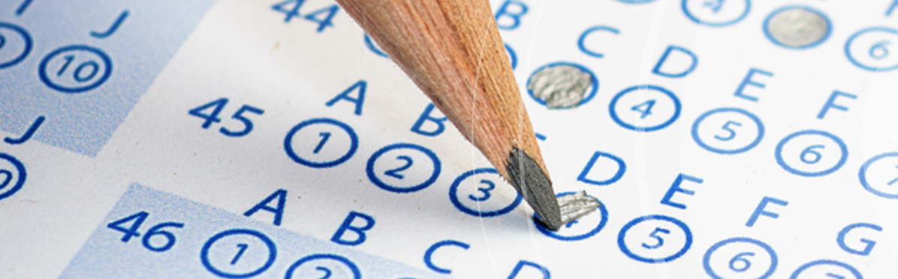

# School District Analysis

## Overview 

The purpose of this analysis was to generate a district-wide summary using Python and the Pandas library. The raw data was provided by several CSV files. The data was explored, inspected, manipulated, cleaned, and converted into DataFrames. 

The project's main goal was to analyze a school district data and showcase trends in school performance. The data contained information on 15 schools and 39,170 students. The results found from this analysis may allow its leaders to make strategic decisions on school budgets and funding.

## Resources

For this project, Anaconda, an open source distribution software, was used. Anaconda supports the use of Jupyter Notebook along with Python. Jupyter Notebook enabled the process of creating and merging documents containing live code.

Working with Jupyter Notebook and Python was vital in the quest to read raw data, change layout and structure, organize the data by type, and create tables. It is similar to Excel/VBA's functionality; however, Jupyter and Pandas Library exceeds in performance and optimization when compared to Excel. 

## Results

For this project the data was manipulated and calculated in order to create DataFrame tables for easier visualization. The following tables were created to inspect the data:

- Student Total Counts
- School Total Budgets
- Average Math and Reading Scores (including by grades)
- Percentage of Students Passing Math/Reading 
- Overall Passing Scores
- School Summary
- District Summary
- Top and Low Performing Schools

The school board was interested in the results of Thomas High School's ninth graders after changing its Math and Reading scores. To do this effectively, the scores for these subjects were replaced with NaNs (Not a Number) while maintaining the rest of the data intact.

After the data manipulation, the school district analysis was repeated to show the overall changes that affected the analysis. As a result of the data wrangling, the following was observed:

### Before the change:

- Passing Math Percentage = 93.3%
- Passing Reading Percentage = 97.3%
- Overall Passing Percentage = 90.9%

### After the changes:

- Passing Math percentage = 93.2%
- Passing Reading Percentage = 69.7%
- Overall Passing percentage = 65.1%

## Fig.1

### Thomas High School After the changes:

 

## Fig.2

### Thomas High School Before the changes:

## Observation

After the changes, the Passing Math Percentage did not change significantly. It was interesting to note the significant change (decrease) on the Passing Reading and Overall Passing Percentages. The ranking for Thomas High School was also lowered as a result from its original second spot.

## Recommendations 

Due to the inconsistencies, and in order to protect the integrity of testing standards, more analysis should be done. A similar comprehensive analysis (such as the one created) from previous years may show when the problem began. Conducting student surveys and interviews on standardized testing may also show key information about the behavior of academic dishonesty in this case. Comprehensive analysis should also be conducted on a yearly basis.
